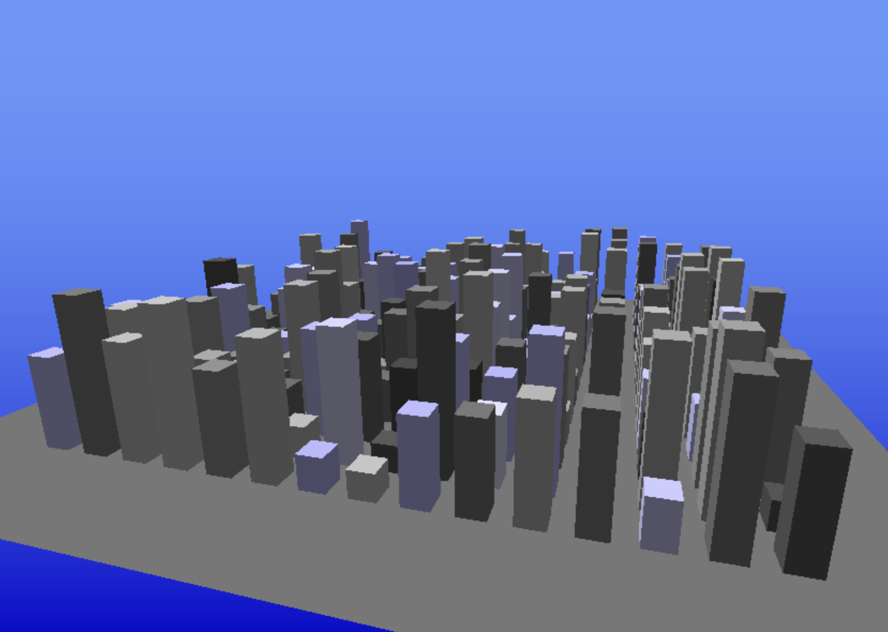
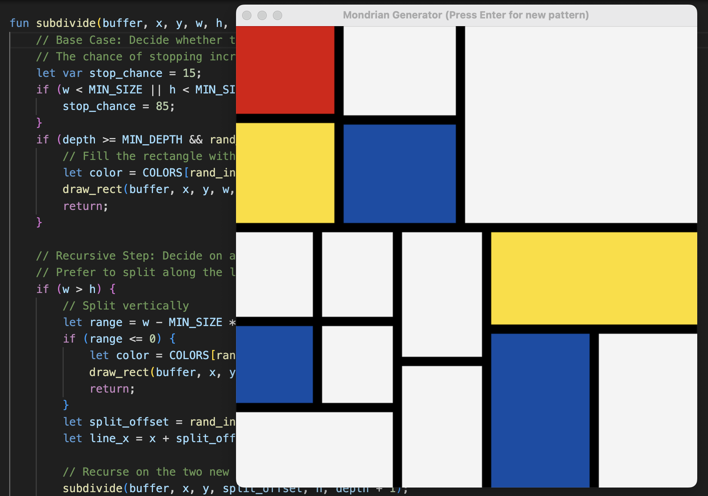
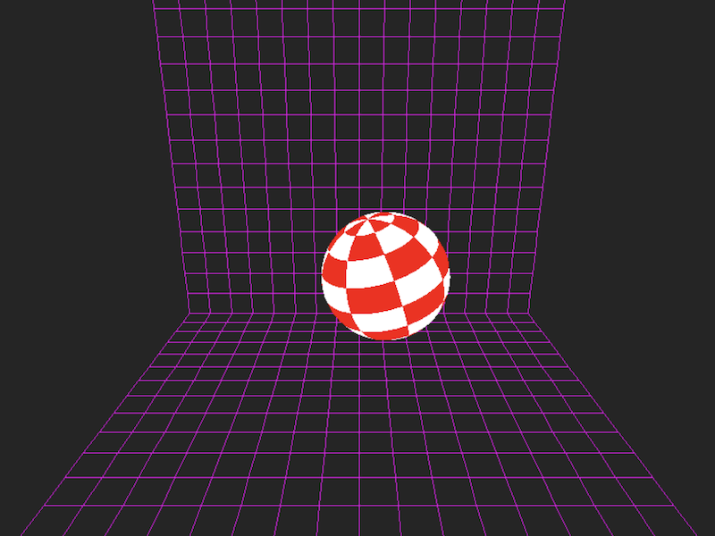

# The Plush Programming Language

<p align="center">
    &nbsp;
    &nbsp;
    
</p>

Plush is a toy programming language and virtual machine for fun, teaching and creative programming.
It follows a minimalistic design philosphy and draws inspiration from JavaScript, Lox, Lua, Python and Rust.
Plush supports actor-based parallelism and is designed such that there is no global VM lock.
The language has straightforward semantics and is built around a simple stack-based interpreter. The codebase is well-commented, has very few depencencies, and good cross-platform support. It has been tested on Linux, Mac and Windows.
Please do note however that this project is very much a fun side-project and a work in progress. You could run into bugs and
missing features.

To get a feel for what Plush code looks like, have a look at the programs in the [/examples](/examples) directory. For a detailed guide to the Plush language, please see the [Plush Language Guide](docs/language.md).

## Build Instructions

Dependencies:
- The [Rust toolchain](https://www.rust-lang.org/tools/install)
- The [SDL2 libraries](https://wiki.libsdl.org/SDL2/Installation)

### Installing Rust and SDL2 on macOS

Install the SDL2 package:
```sh
brew install sdl2
```

Add this to your `~/.zprofile`:
```sh
export LIBRARY_PATH="$LIBRARY_PATH:$(brew --prefix)/lib"
```

Install the Rust toolchain:
```sh
curl --proto '=https' --tlsv1.2 -sSf https://sh.rustup.rs | sh
```

### Installing Rust and SDL2 on Debian/Ubuntu

Install the SDL2 package:
```sh
sudo apt-get install libsdl2-dev
```

Install the Rust toolchain:
```sh
curl --proto '=https' --tlsv1.2 -sSf https://sh.rustup.rs | sh
```

### Installing Rust and SDL2 on Windows

Follow the Windows-specific instructions to [install the Rust toolchain](https://www.rust-lang.org/tools/install).

Get `SDL2.dll` from one of [SDL2 Releases](https://github.com/libsdl-org/SDL/releases).

Copy `SDL2.dll` (unzip) to the root of your cloned repo.

### Compiling the Project

```sh
cargo build
```

To run the test suite:
```sh
cargo test
```

To run a plush script:
```sh
# See example programs under /examples, /benchmarks and /tests
cargo run examples/helloworld.psh
cargo run examples/plasma.psh
```

## Open Source License

The code for Plush, its VM and associated tools is shared under the [Apache-2.0 license](https://github.com/maximecb/plush/blob/main/LICENSE). The example code in the `/examples` directory is shared under the [Creative Commons CC0](https://creativecommons.org/publicdomain/zero/1.0/) license to encourage sharing and remixing.

## Contributing

There is a lot of work to be done to get this project going and contributions are welcome.

A good first step is to look at open issues and read the available documentation. Another easy way to contribute
is to create new example programs showcasing cool things you can do with Plush, or to
[report any bugs and issues](https://github.com/maximecb/plush/issues) you encounter.
If you do report bugs, please provide as much context as possible, and the smallest reproduction you can
come up with.

You can also search the codebase for TODO or FIXME notes:
```sh
grep -IRi "todo" .
```

In general, smaller pull requests are easier to review and easier to iterate on. If you would like to add
a complex feature or make significant refactorings the design of Plush, I
recommend opening an issue or starting a discussion about your proposed changes first.

Please keep in mind that one of the core principles of Plush is to minimize dependencies to keep the VM easy
to install and easy to port. Opening a PR that adds dependencies to multiple new packages and libraries is
unlikely to get merged.

If you think that Plush is cool, you can support my work via [GitHub Sponsors](https://github.com/sponsors/maximecb) :heart:
